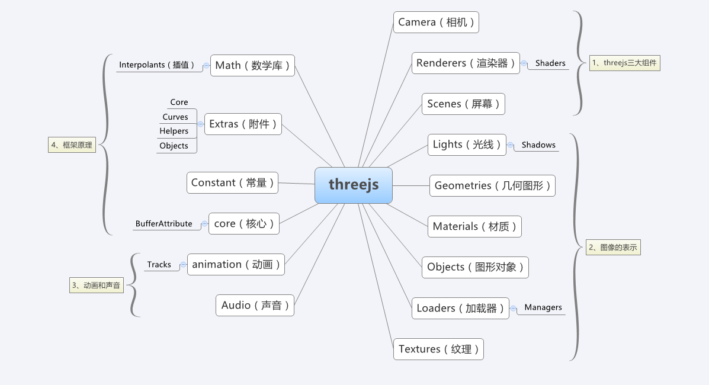

官网：https://threejs.org/docs/

# 一、概述

# 二、三大组件

- 场景：场景是所有物体的容器。
- 相机：拍摄位置，定义可视域，即确定哪些图形元素是可见的。
- 渲染器：渲染器决定渲染结果应该画在页面的什么元素上，并且以何种方式（WegGL还是Canvas）来绘制。

> 提示：这三个组件是创建3D图形的必备组

# 三、思路

要在屏幕上展示3D图形，思路大体上都是这样的：

1. 构建一个三维空间
   - åThree中称之为场景(Scene)
2. 选择一个观察点，并确定观察方向/角度等
   - Three中称之为相机(Camera)
3. 在场景中添加供观察的物体
   - Three中的物体有很多种，包括Mesh,Line,Points等，它们都继承自Object3D类
4. 将观察到的场景渲染到屏幕上的指定区域
   - Three中使用Renderer完成这一工作

# 四、图例



[图片来源 >>](https://teakki.com/p/58a3ef1bf0d40775548c908f)


[图片来源>>](http://ushiroad.com/3j/)

# 五、相关概念

## 1. Scene

场景是所有物体的容器，也对应着我们创建的三维世界。

## 2. Camera

相机定义了场景中哪部分是可以见的，相机有自己的位置（position）、朝向（lookAt）和可视域。我们创建的图形一定要放在相机的可视域中才能看得见。可视域与相机的类型、相机的位置和朝向都有关。

Threejs提供的相机有正交相机（OrthographicCamera）、透视相机（PerspectiveCamera）、全景相机（CubeCamera）和3D相机（StereoCamera）。

### 2.1. 正交相机

正交相机拍摄的效果类似设计图，重在表现物体的实际尺寸，没有近小远大的效果。正交相机的构造方法如下：

```js
OrthographicCamera( left, right, top, bottom, near, far )
```

这个六个参数即是指定视域的左右上下近远六个范围。正交相机的视域是立方体：

[参考示例 >>](http://threejs-outsidelook.oss-cn-shanghai.aliyuncs.com/r89/source/examples/index.html?q=camera#webgl_camera) , 按 `O` 键。

### 2.2. 透视相机

透视相机拍摄的效果类似人眼所见，即有近小远大的效果。其构造方法如下：

```js
PerspectiveCamera( fov, aspect, near, far )
```

- fov：指定视角
- aspect：指定视图宽高比
- near：近平面
- far：远平面

[参考示例 >>](http://threejs-outsidelook.oss-cn-shanghai.aliyuncs.com/r89/source/examples/index.html?q=camera#webgl_camera) , 按 `P` 键。

### 2.3. 全景相机

全景相机就是可以360度拍摄的相机，见过百度地图全景街景拍摄车的话，应该会有印象，就像下面这个：


在threejs中，全景相机构造也类似，使用六个不同方向上的相机同时拍摄，将拍摄的结果融合到同一个画面中。这有点像VR的概念，无论你看向画面的哪个方向，都能看到那个方向的景物。

[效果示例 >>](http://threejs-outsidelook.oss-cn-shanghai.aliyuncs.com/r89/source/examples/index.html?q=dynamic#webgl_materials_cubemap_dynamic2)

### 2.4. 3D相机

这个3D相机应该叫浮雕3D相机，它是用两个不同位置的透视相机同时拍摄，将拍摄的结果合成为一个画面。这便是早期3D电影的表现方法，通过让人的两只眼睛看到稍微不同的图像，来欺骗人的感觉，让人好像看到了立体一样。可以打开下面的链接，看看这种相机的拍摄效果：[效果示例 >>](http://threejs-outsidelook.oss-cn-shanghai.aliyuncs.com/r89/source/examples/index.html?q=anaglyph#webgl_effects_anaglyph)


Camera是三维世界中的观察者，为了观察这个世界，首先我们要描述空间中的位置。


Three中使用采用常见的[右手坐标系](https://link.zhihu.com/?target=https%3A//zh.wikipedia.org/wiki/%E7%AC%9B%E5%8D%A1%E5%84%BF%E5%9D%90%E6%A0%87%E7%B3%BB%23.E4.B8.89.E7.B6.AD.E7.A9.BA.E9.96.93)定位。

Three中的相机有两种，分别是正投影相机THREE.OrthographicCamera和透视投影相机THREE.PerspectiveCamera。


正交投影与透视投影的区别如上图所示，左图是正交投影，物体发出的光平行地投射到屏幕上，远近的方块都是一样大的；右图是透视投影，近大远小，符合我们平时看东西的感觉。

## 3. Renderers

渲染器其实代表的是 \<canvas> 标签。主要包括以下两类：

- WebGLRender：使用WebGL来渲染图形，速度较快，但是有些机器不支持WebGL。
- CanvasRender：使用canvas2d来渲染图形，在较老的版本上，主要是用来渲染2D图形。新版本已弃用。

创建渲染器：

```js
let renderer = new THREE.WebGLRenderer();
renderer.setSize(500, 300);
document.body.appendChild(renderer.domElement);
```

在threejs中，渲染器可以视为是`<canvas>`标签，相机可以视为画布。注意画布和`<canvas>`标签不是同一个东西，`<canvas>`标签是画布的容器。画布就好比一张图片，而`<canvas>`标签就像``标签。

# # 基本图形元素

```markdown
# Objects

1. 点、线、面
- Points：点
- Line：线
- LineSegments：虚线
- Mesh：网格模型

2. 精灵
- Sprite

3. 骨骼
- Bone：骨骼
- Skeleton：骨架，由多根骨骼组成
- SkinnedMesh：皮肤，附着在骨骼上的图形

4. 其他
- Group：组
- LensFlare：光晕
- LOD：细节级别
```

# # 几何形状 & 材质


